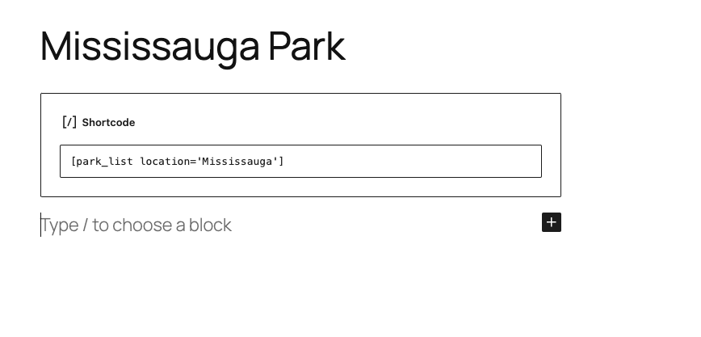

Install the ZIP file, ensuring the wp-content folder has the correct ownership.

Activate after successful installation

The Park plugin will be displayed in the Admin Dashboard after successful installation.

This is the display for Adding/Editing a Park Post. The start time should be earlier than the end time, otherwise, an error message will be displayed, and the time will not be saved.

The list of posts will look like this.

Create a post without the filter applied.

Create a post with the filter applied.
The filter parameters are: name, location, facility.

